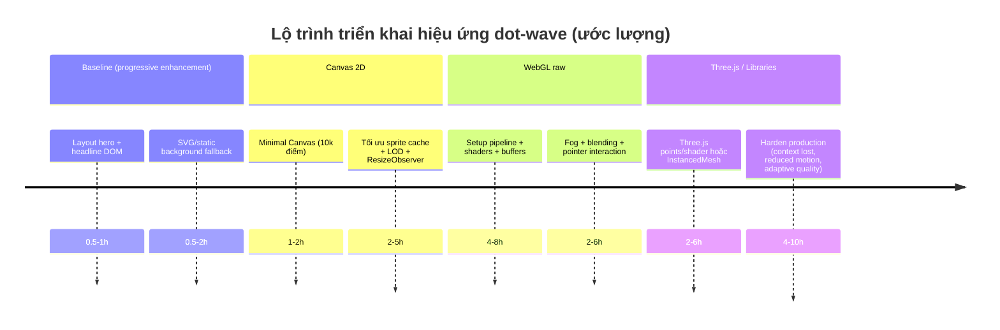

# Hướng dẫn tái tạo hiệu ứng “3D dot wave” nền tối cho hero section

## Tóm tắt điều hành

Hiệu ứng bạn mô tả (nền tối, rất nhiều chấm nhỏ tạo thành một bề mặt “sóng” 3D chuyển động, chữ lớn nằm giữa) về bản chất là một **heightfield**: một lưới điểm (x, z) có **độ cao y = f(x, z, t)** thay đổi theo thời gian, được render thành **point sprites** (chấm tròn) và phối cảnh để tạo cảm giác 3D. Trên web, hiệu ứng này gần như luôn được vẽ vào `<canvas>` (Canvas 2D hoặc WebGL) và **headline vẫn là DOM thật** để đảm bảo SEO + accessibility. citeturn6search18turn12view1

Về triển khai, có 3 “đường” tối ưu tùy mục tiêu:

- **Nhanh nhất để giống ảnh**: WebGL/Three.js với **points + shader** (vertex tính sóng và kích thước theo độ sâu; fragment dùng `gl_PointCoord` để cắt thành chấm tròn). Đây là pattern chuẩn trong demo “points waves” của Three.js và cũng là cách phổ biến để làm hạt/chấm tròn đẹp, số lượng lớn. citeturn11view3turn11view1turn0search15  
- **Từ scratch chuẩn học thuật**: raw WebGL + GLSL tự viết (compile/link shader, buffer grid, render `gl.POINTS`). WebGL được thiết kế như một rendering context cho HTML Canvas và kế thừa hành vi từ OpenGL ES 2.0; vì vậy những khái niệm như `gl_PointSize`, `gl_PointCoord`, giới hạn kích thước point đều bám spec OpenGL ES. citeturn12view1turn18view3  
- **Đơn giản, không phụ thuộc GPU**: Canvas 2D giả lập 3D bằng phép chiếu perspective và vẽ từng chấm. Dễ bắt đầu nhưng khi số chấm tăng (hàng chục nghìn) CPU sẽ nhanh “đụng trần”, buộc phải tối ưu (sprite cache, LOD). citeturn6search18turn0search5  

Tất cả các đường trên nên được đóng gói theo **progressive enhancement**: cung cấp baseline nội dung (headline + nền tĩnh/SVG), rồi nâng cấp lên Canvas 2D hoặc WebGL khi trình duyệt hỗ trợ, tôn trọng `prefers-reduced-motion` cho người nhạy cảm chuyển động. citeturn14search0turn14search12turn14search1

## Giải phẫu hiệu ứng và những chi tiết cần “bắt chước” cho giống ảnh

Ảnh bạn đưa rất giống hero của entity["organization","WorldQuant Foundry","venture studio website"] ở trang “Why WQF”, với headline “The future isn’t something that happens. It’s something we build.” nằm giữa và nền chấm sóng phía dưới. citeturn3search17turn4view0  

Để tái tạo “đúng chất”, bạn cần tái hiện 6 đặc trưng thị giác (một số chi tiết định lượng trong ảnh là **không xác định** nên mình đưa default + range để bạn tune):

- **Bề mặt sóng là “lưới” điểm**: thay vì particle ngẫu nhiên, đây thường là grid đều (AMOUNTX×AMOUNTZ) với khoảng cách cố định, giúp trật tự thị giác “mịn” như mặt nước số hoá. (Trong demo chính thức của Three.js, grid = `AMOUNTX * AMOUNTY` và `SEPARATION` cố định.) citeturn11view0turn11view1  
- **Sóng kép (hai sinus) hoặc noise**: y thường là tổng của 2 sin theo trục x và z (hoặc simplex/perlin). Demo Three.js dùng:  
  `y = sin((ix+count)*0.3)*50 + sin((iy+count)*0.5)*50`. citeturn11view1  
- **Phối cảnh + size attenuation**: chấm ở gần camera trông to hơn. Với point sprites WebGL, điều này thường làm bằng `gl_PointSize = size * (k / -mvPosition.z)` (tỉ lệ nghịch với độ sâu trong view space). citeturn11view3turn18view3  
- **Chấm tròn (không phải ô vuông)**: primitive `gl.POINTS` rasterize thành hình **vuông**, nhưng fragment shader dùng `gl_PointCoord` (toạ độ 0→1 bên trong point) để discard pixel ngoài bán kính, biến vuông thành tròn. OpenGL ES mô tả rõ `gl_PointCoord` là không gian toạ độ per-fragment 0..1 theo chiều ngang/dọc của point. citeturn18view3  
- **Fog/độ mờ theo khoảng cách**: trong ảnh, vùng xa gần như tan vào nền đen. Có thể làm bằng fog tuyến tính (linear fog) hoặc đơn giản là alpha giảm theo depth. Three.js hỗ trợ fog và có thể trộn uniform fog vào shader. citeturn11view0turn16view0  
- **DOM overlay độc lập**: headline phải là `<h1>` thật, canvas chỉ là nền trang trí (decorative). Điều này phù hợp với progressive enhancement và accessibility. citeturn14search0turn7search7  

image_group{"layout":"carousel","aspect_ratio":"16:9","query":["dark website hero particle wave dots background","three.js points waves particles background","webgl point sprite dot wave animation"],"num_per_query":1}

## So sánh phương pháp và chiến lược progressive enhancement

### Bảng so sánh nhanh

| Hướng tiếp cận | Hiệu năng khi nhiều điểm | Độ phức tạp dev | Tùy biến “chất” thị giác | Hỗ trợ trình duyệt (tổng quan) |
|---|---:|---:|---:|---|
| Canvas 2D | Trung bình → thấp khi >10k–30k điểm (CPU-bound) | Thấp | Vừa (giả 3D, alpha, blur thủ công) | Rất rộng (Canvas API phổ biến) citeturn6search18 |
| Raw WebGL + GLSL | Cao (GPU-bound) | Cao | Rất cao (shader tùy ý) | Rộng trên desktop/mobile hiện đại; cần feature detect citeturn12view1turn14search12 |
| Three.js (Points + ShaderMaterial) | Cao | Trung bình | Rất cao (shader + hệ sinh thái) | Rộng (dựa trên WebGL/WebGL2) citeturn0search15turn0search3 |
| Three.js (InstancedMesh) | Cao (tối ưu draw call) | Trung bình → cao | Cao (quads/sprites/custom) | Rộng; lợi khi nhiều instance cùng material citeturn0search11 |
| regl | Cao | Trung bình | Cao (WebGL nhưng ít state pain) | Rộng như WebGL; cần học model “command” citeturn2search0turn12view1 |
| PixiJS | Cao cho 2D sprites/particles | Trung bình | Vừa → cao (tập trung 2D; có shader/mesh) | Rộng; renderer dùng WebGL/WebGPU citeturn15search3turn17view0 |
| SVG fallback | Thấp nếu nhiều node | Thấp | Thấp → vừa | Rất rộng; phù hợp baseline tĩnh citeturn7search0turn7search5 |

Ghi chú quan trọng về WebGL points: kích thước point (`gl_PointSize`) bị **clamp** theo `ALIASED_POINT_SIZE_RANGE`; OpenGL ES nêu rõ point size lấy từ `gl_PointSize` và clamp theo range phụ thuộc implementation. citeturn18view3turn16view0turn2search10  

### Progressive enhancement đề xuất

Progressive enhancement là triết lý “có baseline nội dung cho mọi người, nâng cấp dần cho browser hiện đại”. citeturn14search0turn14search3  
Với hiệu ứng này, baseline + nâng cấp hợp lý nhất:

1. **Baseline (không JS / JS fail):** nền tĩnh (màu/gradient) + headline + (tuỳ) SVG tĩnh ít điểm.  
2. **Enhancement cấp 1:** Canvas 2D (nhẹ, ít dependency) nếu WebGL không có hoặc bị chặn. citeturn6search2turn6search18  
3. **Enhancement cấp 2:** WebGL/Three.js/regl/PixiJS khi detect được WebGL context. MDN có ví dụ detect WebGL dựa trên `canvas.getContext('webgl')` trả `null` nếu không hỗ trợ. citeturn6search8turn14search12  
4. **Tôn trọng giảm chuyển động:** nếu `prefers-reduced-motion: reduce`, giảm amplitude/tốc độ hoặc chuyển sang nền tĩnh. citeturn14search1turn7search2  

Mermaid flow cho pipeline tổng thể (Canvas/WebGL đều áp dụng):

```mermaid
flowchart TD
  A[Input: time, resize, pointer, DPR] --> B[Chọn renderer theo feature detect]
  B -->|SVG baseline| C[Render tĩnh: SVG/gradient + headline DOM]
  B -->|Canvas 2D| D[CPU: tính y=f(x,z,t) + chiếu 3D->2D]
  D --> E[Vẽ chấm: arc/drawImage sprite]
  B -->|WebGL/Three/regl/Pixi GPU| F[Upload buffer & uniforms]
  F --> G[Vertex shader: wave + camera + size attenuation]
  G --> H[Rasterize: POINTS hoặc instanced quads]
  H --> I[Fragment shader: gl_PointCoord mask + fog/alpha]
  E --> J[Composite]
  I --> J
  J --> K[DOM overlay: headline, nav, CTA]
  K --> L[Output frame]
```

## Triển khai chi tiết theo nhiều lựa chọn

Phần này cung cấp **nhiều lựa chọn**: Canvas tối giản, WebGL raw (GLSL đầy đủ), Three.js instancing, particle engine nhẹ (Canvas tối ưu), kèm phiên bản “bonus” cho regl, PixiJS và SVG fallback. Các tham số “giống ảnh” (số chấm, biên độ, noise…) trong ảnh là **không xác định**, nên mỗi lựa chọn đều có config + range để bạn tinh chỉnh.

### Khung HTML/CSS chung cho mọi lựa chọn

Bạn nên giữ bố cục hero như sau: canvas là nền tuyệt đối (absolute), text là DOM.

```html
<!-- index.html (khung chung) -->
<!doctype html>
<html lang="vi">
<head>
  <meta charset="utf-8" />
  <meta name="viewport" content="width=device-width, initial-scale=1" />
  <title>Dot Wave Hero</title>
  <style>
    :root { color-scheme: dark; }
    html, body { height: 100%; margin: 0; }
    body { background: #0a0a0a; font-family: system-ui, -apple-system, Segoe UI, Roboto, Arial, sans-serif; }

    .hero {
      position: relative;
      min-height: 100vh;
      overflow: hidden;
      display: grid;
      place-items: center;
      background: radial-gradient(1200px 700px at 50% 30%, rgba(255,255,255,0.04), rgba(0,0,0,0.0) 60%),
                  linear-gradient(#0a0a0a, #050505);
    }

    canvas.bg {
      position: absolute;
      inset: 0;
      width: 100%;
      height: 100%;
      z-index: 0;
      /* Nền trang trí: đừng bắt pointer nếu không cần tương tác */
      pointer-events: none;
    }

    .content {
      position: relative;
      z-index: 1;
      text-align: center;
      padding: 0 6vw;
      max-width: 1100px;
    }

    .content h1 {
      margin: 0;
      font-weight: 700;
      letter-spacing: 0.06em;
      text-transform: uppercase;
      line-height: 1.05;
      font-size: clamp(28px, 5vw, 72px);
      color: rgba(255,255,255,0.88);
      text-shadow: 0 6px 30px rgba(0,0,0,0.5);
    }

    .content p {
      margin-top: 18px;
      color: rgba(255,255,255,0.65);
      font-size: clamp(14px, 1.8vw, 18px);
    }

    /* Respect reduced motion: vẫn giữ layout + text */
    @media (prefers-reduced-motion: reduce) {
      canvas.bg { display: none; }
    }
  </style>
</head>
<body>
  <main class="hero">
    <canvas id="bg" class="bg" aria-hidden="true"></canvas>
    <section class="content">
      <h1>THE FUTURE ISN’T SOMETHING THAT HAPPENS.<br/>IT’S SOMETHING WE BUILD.</h1>
      <p>Nền dot-wave được render bằng Canvas/WebGL; chữ là DOM để accessible.</p>
    </section>
  </main>
</body>
</html>
```

Vì canvas là trang trí, `aria-hidden="true"` giúp loại nó khỏi accessibility tree. citeturn7search7  
Đoạn CSS `prefers-reduced-motion` dùng media query chuẩn để giảm chuyển động. citeturn14search1turn7search2  

---

### Lựa chọn Canvas 2D tối giản

**Khi nên dùng:** prototype nhanh, ít dependency, số điểm vừa phải (gợi ý < 10k–20k tùy máy). Canvas API chủ yếu cho 2D; animation thường chạy bằng `requestAnimationFrame`. citeturn6search18turn0search0  

**Dependency:** không.  
**Chạy:** lưu thành `canvas-minimal.html`, mở trực tiếp hoặc qua server đều được.  

#### Code đầy đủ (HTML/CSS/JS)

```html
<!doctype html>
<html lang="vi">
<head>
  <meta charset="utf-8" />
  <meta name="viewport" content="width=device-width, initial-scale=1" />
  <title>Canvas 2D Minimal Dot Wave</title>
  <style>
    :root { color-scheme: dark; }
    html, body { height: 100%; margin: 0; }
    body { background: #0a0a0a; font-family: system-ui, sans-serif; }
    .hero { position: relative; min-height: 100vh; display: grid; place-items: center; overflow: hidden; }
    canvas { position: absolute; inset: 0; width: 100%; height: 100%; z-index: 0; }
    .content { position: relative; z-index: 1; text-align: center; padding: 0 6vw; max-width: 1100px; }
    h1 { margin: 0; font-weight: 700; letter-spacing: .06em; text-transform: uppercase;
         font-size: clamp(28px, 5vw, 72px); line-height: 1.05; color: rgba(255,255,255,.88); }
    p { margin-top: 16px; color: rgba(255,255,255,.6); }
    @media (prefers-reduced-motion: reduce) { canvas { display:none; } }
  </style>
</head>
<body>
  <main class="hero">
    <canvas id="bg" aria-hidden="true"></canvas>
    <section class="content">
      <h1>THE FUTURE ISN’T SOMETHING THAT HAPPENS.<br/>IT’S SOMETHING WE BUILD.</h1>
      <p>Canvas 2D tối giản: giả lập lưới 3D + phối cảnh + vẽ chấm.</p>
    </section>
  </main>

  <script>
    /**
     * =========================
     * CONFIG (default + ranges)
     * =========================
     * Lưu ý: “giống ảnh” chính xác là KHÔNG XÁC ĐỊNH, nên đây là baseline hợp lý.
     */
    const cfg = {
      gridX: 160,        // số cột (gợi ý: 80–240)
      gridZ: 90,         // số hàng (gợi ý: 50–160)
      spacing: 14,       // khoảng cách giữa điểm (px world) (gợi ý: 8–22)

      amp: 38,           // biên độ sóng (gợi ý: 10–80)
      freq: 0.055,       // tần số theo world units (gợi ý: 0.02–0.12)
      speed: 0.0012,     // tốc độ (ms->phase) (gợi ý: 0.0005–0.0030)

      // Camera + phối cảnh (giả lập)
      cameraZ: 900,      // “khoảng cách” camera (gợi ý: 500–1400)
      tiltX: 0.75,       // nghiêng mặt phẳng theo X (rad) (gợi ý: 0.4–1.1)
      tiltY: -0.35,      // xoay theo Y (rad) (gợi ý: -0.9–0.3)
      centerY: 0.68,     // điểm đặt chân sóng trên màn (tỉ lệ chiều cao) (gợi ý: 0.55–0.80)

      baseDot: 1.15,     // size cơ bản (px) trước scale (gợi ý: 0.6–2.0)
      fogNear: 200,      // bắt đầu fog theo zCam (gợi ý: 0–500)
      fogFar: 1400       // kết thúc fog theo zCam (gợi ý: 800–2400)
    };

    const canvas = document.getElementById('bg');
    const ctx = canvas.getContext('2d');

    // rAF là vòng lặp animation chuẩn: chạy trước repaint và thường sync refresh rate. (MDN)
    // (Thông tin chi tiết xem phần “References” của báo cáo.)
    let w = 0, h = 0, dpr = 1;

    function resize() {
      const rect = canvas.getBoundingClientRect();
      w = rect.width;
      h = rect.height;

      // Tránh render quá “nặng” ở DPR lớn: clamp 2 là thực tế.
      dpr = Math.min(window.devicePixelRatio || 1, 2);

      canvas.width  = Math.round(w * dpr);
      canvas.height = Math.round(h * dpr);

      // Vẽ trong hệ tọa độ CSS pixel
      ctx.setTransform(dpr, 0, 0, dpr, 0, 0);
    }
    window.addEventListener('resize', resize);
    resize();

    // Precompute grid (x,z)
    const pts = [];
    for (let iz = 0; iz < cfg.gridZ; iz++) {
      for (let ix = 0; ix < cfg.gridX; ix++) {
        const x = (ix - cfg.gridX / 2) * cfg.spacing;
        const z = (iz - cfg.gridZ / 2) * cfg.spacing;
        pts.push({ x, z, ix, iz });
      }
    }

    function rotY(x, z, a) {
      const c = Math.cos(a), s = Math.sin(a);
      return [x * c - z * s, x * s + z * c];
    }
    function rotX(y, z, a) {
      const c = Math.cos(a), s = Math.sin(a);
      return [y * c - z * s, y * s + z * c];
    }
    function clamp(v, lo, hi) { return Math.max(lo, Math.min(hi, v)); }

    const reducedMotion = matchMedia('(prefers-reduced-motion: reduce)');
    let running = !reducedMotion.matches;

    reducedMotion.addEventListener?.('change', (e) => {
      running = !e.matches;
      if (running) requestAnimationFrame(loop);
    });

    function loop(ms) {
      if (!running) return;

      const time = ms * cfg.speed;

      // Clear
      ctx.clearRect(0, 0, w, h);

      // Nền đen (fallback nếu CSS nền bị thay đổi)
      ctx.fillStyle = '#0a0a0a';
      ctx.fillRect(0, 0, w, h);

      const cx = w * 0.5;
      const cy = h * cfg.centerY;

      // Vẽ từ xa -> gần theo iz để “đỡ” sorting mỗi frame (đơn giản, chấp nhận sai lệch nhỏ)
      for (let iz = 0; iz < cfg.gridZ; iz++) {
        for (let ix = 0; ix < cfg.gridX; ix++) {
          const p = pts[iz * cfg.gridX + ix];

          // 1) Sóng: y = sin(x) + sin(z)
          const y =
            Math.sin(p.x * cfg.freq + time) * cfg.amp +
            Math.sin(p.z * cfg.freq * 1.35 + time * 1.25) * cfg.amp;

          // 2) Xoay mặt phẳng để tạo chiều sâu
          let x = p.x;
          let z = p.z;

          [x, z] = rotY(x, z, cfg.tiltY);
          let yy = y;
          [yy, z] = rotX(yy, z, cfg.tiltX);

          // 3) Phối cảnh: zCam = cameraZ - zWorld
          const zCam = cfg.cameraZ - z;
          if (zCam <= 1) continue;

          const scale = cfg.cameraZ / zCam;

          const sx = cx + x * scale;
          const sy = cy + yy * scale;

          // 4) Fog + kích thước điểm
          const fog = clamp((zCam - cfg.fogNear) / (cfg.fogFar - cfg.fogNear), 0, 1);
          const alpha = (1 - fog) * 0.85;

          // Skip nếu ngoài màn
          if (sx < -50 || sx > w + 50 || sy < -50 || sy > h + 50) continue;

          const r = clamp(cfg.baseDot * scale, 0.2, 4.0);

          ctx.globalAlpha = alpha;
          ctx.beginPath();
          ctx.arc(sx, sy, r, 0, Math.PI * 2);
          ctx.fillStyle = 'white';
          ctx.fill();
        }
      }

      ctx.globalAlpha = 1;
      requestAnimationFrame(loop);
    }

    requestAnimationFrame(loop);
  </script>
</body>
</html>
```

#### Tuning tips (Canvas tối giản)

- Nếu máy yếu/mobile: giảm `gridX/gridZ` hoặc tăng `spacing` để giảm số điểm; đây là “đòn” hiệu quả nhất khi Canvas CPU-bound. citeturn0search5  
- Nếu chấm bị “răng cưa”/mờ: kiểm tra handling DPR và setTransform; `devicePixelRatio` là tỷ lệ pixel vật lý/CSS pixel. citeturn0search1  
- Nếu muốn giống ảnh hơn: tăng `tiltX`, đẩy `centerY` xuống (0.68→0.75), tăng fog (fogNear nhỏ, fogFar vừa). (Chi tiết định lượng trong ảnh: **không xác định**.)

---

### Lựa chọn Particle engine “nhẹ” dùng requestAnimationFrame (Canvas 2D tối ưu)

**Mục tiêu:** vẫn Canvas 2D nhưng chạy mượt hơn bằng các kỹ thuật thực dụng:

- **Sprite cache**: pre-render một chấm (radial gradient) lên offscreen canvas rồi `drawImage` thay vì `arc` hàng chục nghìn lần; MDN gợi ý pre-render lên offscreen để tối ưu canvas. citeturn14search2turn6search9  
- **LOD động**: tự tăng “bước” lấy mẫu (skip điểm) khi FPS tụt.  
- **ResizeObserver**: theo dõi kích thước container thay vì chỉ `window.resize`. ResizeObserver là API chuẩn để theo dõi thay đổi kích thước element. citeturn6search3turn6search7  

**Dependency:** không.  
**Chạy:** lưu `canvas-particles-optimized.html`, mở trực tiếp hoặc server.

```html
<!doctype html>
<html lang="vi">
<head>
  <meta charset="utf-8" />
  <meta name="viewport" content="width=device-width, initial-scale=1" />
  <title>Canvas Particle Engine Optimized</title>
  <style>
    :root { color-scheme: dark; }
    html, body { height: 100%; margin: 0; }
    body { background:#0a0a0a; font-family: system-ui, sans-serif; }
    .hero { position: relative; min-height: 100vh; display:grid; place-items:center; overflow:hidden; }
    canvas { position:absolute; inset:0; width:100%; height:100%; }
    .content { position:relative; z-index:1; text-align:center; padding:0 6vw; max-width:1100px; }
    h1 { margin:0; font-weight:700; letter-spacing:.06em; text-transform:uppercase;
         font-size:clamp(28px,5vw,72px); line-height:1.05; color:rgba(255,255,255,.88); }
    p { margin-top:16px; color:rgba(255,255,255,.6); }
    @media (prefers-reduced-motion: reduce) { canvas { display:none; } }
  </style>
</head>
<body>
  <main class="hero" id="hero">
    <canvas id="bg" aria-hidden="true"></canvas>
    <section class="content">
      <h1>THE FUTURE ISN’T SOMETHING THAT HAPPENS.<br/>IT’S SOMETHING WE BUILD.</h1>
      <p>Canvas 2D tối ưu: sprite cache + LOD động + ResizeObserver.</p>
    </section>
  </main>

  <script>
    const cfg = {
      // Grid
      gridX: 220,         // 120–300
      gridZ: 120,         // 70–200
      spacing: 11,        // 7–18

      // Wave
      amp: 42,            // 10–90
      freq: 0.05,         // 0.02–0.12
      speed: 0.0011,      // 0.0004–0.003

      // Camera-ish
      cameraZ: 1000,      // 600–1600
      tiltX: 0.85,        // 0.4–1.2
      tiltY: -0.32,       // -0.9–0.3
      centerY: 0.72,      // 0.55–0.85

      // Dot render
      dotSpriteSize: 48,  // kích thước sprite cache (px). 32–96
      dotBasePx: 2.2,     // base radius (px) trước scale. 1.0–4.0
      dotMaxPx: 9.0,      // clamp radius
      minAlpha: 0.05,

      // Fog
      fogNear: 120,
      fogFar: 1700,

      // LOD / adaptive quality
      lodStep: 1,         // 1 = vẽ tất cả; 2 = skip 1/2; 3 = skip 1/3 ...
      lodMin: 1,
      lodMax: 6,

      // FPS target
      targetFps: 55
    };

    const hero = document.getElementById('hero');
    const canvas = document.getElementById('bg');
    const ctx = canvas.getContext('2d');

    // 1) Sprite cache (offscreen)
    function makeDotSprite(size) {
      const off = (typeof OffscreenCanvas !== 'undefined')
        ? new OffscreenCanvas(size, size)
        : Object.assign(document.createElement('canvas'), { width: size, height: size });

      const c = off.getContext('2d');
      const r = size / 2;

      // radial gradient dot
      const g = c.createRadialGradient(r, r, 0, r, r, r);
      g.addColorStop(0.0, 'rgba(255,255,255,0.95)');
      g.addColorStop(0.35, 'rgba(255,255,255,0.55)');
      g.addColorStop(1.0, 'rgba(255,255,255,0.0)');

      c.fillStyle = g;
      c.beginPath();
      c.arc(r, r, r, 0, Math.PI * 2);
      c.fill();

      return off;
    }

    const dotSprite = makeDotSprite(cfg.dotSpriteSize);

    // 2) Resize handling (ResizeObserver + DPR)
    let w = 0, h = 0, dpr = 1;

    function resize() {
      const rect = canvas.getBoundingClientRect();
      w = rect.width;
      h = rect.height;

      dpr = Math.min(window.devicePixelRatio || 1, 2);
      canvas.width = Math.round(w * dpr);
      canvas.height = Math.round(h * dpr);
      ctx.setTransform(dpr, 0, 0, dpr, 0, 0);
    }

    // ResizeObserver là cơ chế chuẩn để theo dõi size của element (MDN)
    const ro = new ResizeObserver(resize);
    ro.observe(hero);
    resize();

    // 3) Precompute grid (dùng typed arrays + index math cho nhanh)
    const count = cfg.gridX * cfg.gridZ;
    const baseX = new Float32Array(count);
    const baseZ = new Float32Array(count);

    {
      let k = 0;
      for (let iz = 0; iz < cfg.gridZ; iz++) {
        for (let ix = 0; ix < cfg.gridX; ix++) {
          baseX[k] = (ix - cfg.gridX / 2) * cfg.spacing;
          baseZ[k] = (iz - cfg.gridZ / 2) * cfg.spacing;
          k++;
        }
      }
    }

    function rotY(x, z, a) { const c=Math.cos(a), s=Math.sin(a); return [x*c - z*s, x*s + z*c]; }
    function rotX(y, z, a) { const c=Math.cos(a), s=Math.sin(a); return [y*c - z*s, y*s + z*c]; }
    function clamp(v, lo, hi) { return Math.max(lo, Math.min(hi, v)); }

    // 4) Adaptive LOD (ước lượng FPS từ delta)
    let lastMs = performance.now();
    let smoothDt = 16.7;

    const reducedMotion = matchMedia('(prefers-reduced-motion: reduce)');
    let running = !reducedMotion.matches;

    reducedMotion.addEventListener?.('change', (e) => {
      running = !e.matches;
      if (running) requestAnimationFrame(loop);
    });

    function adjustLod(dtMs) {
      // EMA smoothing
      smoothDt = smoothDt * 0.9 + dtMs * 0.1;
      const fps = 1000 / smoothDt;

      if (fps < cfg.targetFps - 10 && cfg.lodStep < cfg.lodMax) cfg.lodStep++;
      if (fps > cfg.targetFps + 5  && cfg.lodStep > cfg.lodMin) cfg.lodStep--;
    }

    function loop(ms) {
      if (!running) return;
      const dt = ms - lastMs;
      lastMs = ms;
      adjustLod(dt);

      const t = ms * cfg.speed;

      ctx.clearRect(0, 0, w, h);
      ctx.fillStyle = '#0a0a0a';
      ctx.fillRect(0, 0, w, h);

      const cx = w * 0.5;
      const cy = h * cfg.centerY;

      const step = cfg.lodStep;

      // Vẽ theo “hàng” để giữ thứ tự gần-xa tương đối
      for (let iz = 0; iz < cfg.gridZ; iz += step) {
        for (let ix = 0; ix < cfg.gridX; ix += step) {
          const idx = iz * cfg.gridX + ix;

          const x0 = baseX[idx];
          const z0 = baseZ[idx];

          const y =
            Math.sin(x0 * cfg.freq + t) * cfg.amp +
            Math.sin(z0 * cfg.freq * 1.35 + t * 1.25) * cfg.amp;

          let x = x0, z = z0;
          [x, z] = rotY(x, z, cfg.tiltY);
          let yy = y;
          [yy, z] = rotX(yy, z, cfg.tiltX);

          const zCam = cfg.cameraZ - z;
          if (zCam <= 1) continue;

          const scale = cfg.cameraZ / zCam;

          const sx = cx + x * scale;
          const sy = cy + yy * scale;

          if (sx < -80 || sx > w + 80 || sy < -80 || sy > h + 80) continue;

          // Fog alpha
          const fog = clamp((zCam - cfg.fogNear) / (cfg.fogFar - cfg.fogNear), 0, 1);
          let alpha = clamp((1 - fog) * 0.95, cfg.minAlpha, 1);

          // Dot size (sprite-based)
          const r = clamp(cfg.dotBasePx * scale, 0.2, cfg.dotMaxPx);
          const size = r * 2;

          ctx.globalAlpha = alpha;

          // drawImage: dùng sprite cache -> nhanh hơn vẽ arc nhiều lần
          ctx.drawImage(dotSprite, sx - size / 2, sy - size / 2, size, size);
        }
      }

      ctx.globalAlpha = 1;
      requestAnimationFrame(loop);
    }

    requestAnimationFrame(loop);
  </script>
</body>
</html>
```

**Hiệu năng & tradeoff:** cách này vẫn CPU-bound ở phần “tính + chiếu” nhưng giảm đáng kể chi phí draw bằng sprite cache (theo đúng hướng dẫn tối ưu canvas của MDN). citeturn14search2turn0search5  
Nếu cần >100k điểm ổn định, bạn nên chuyển sang WebGL/Three/regl (GPU). citeturn6search18turn12view1  

---

### Lựa chọn WebGL raw + GLSL (vertex + fragment shader đầy đủ)

**Khi nên dùng:** bạn muốn kiểm soát tối đa, muốn “đúng bài” shader (`gl_PointCoord`, fog, size attenuation), và tối ưu bằng GPU. WebGL là rendering context cho `<canvas>` và hành vi nhiều API/GLSL dựa trên OpenGL ES 2.0. citeturn12view1turn6search8  

**Dependency:** không.  
**Chạy:** lưu `webgl-raw-dot-wave.html`. Khuyến nghị chạy qua server local (để dễ debug + nhất quán), nhưng đa số trình duyệt vẫn chạy WebGL trên `file://`.  

#### Code đầy đủ (HTML/CSS/JS + shaders)

```html
<!doctype html>
<html lang="vi">
<head>
  <meta charset="utf-8" />
  <meta name="viewport" content="width=device-width, initial-scale=1" />
  <title>Raw WebGL Dot Wave</title>
  <style>
    :root { color-scheme: dark; }
    html, body { height:100%; margin:0; }
    body { background:#0a0a0a; font-family: system-ui, sans-serif; }
    .hero { position:relative; min-height:100vh; display:grid; place-items:center; overflow:hidden; }
    canvas { position:absolute; inset:0; width:100%; height:100%; }
    .content { position:relative; z-index:1; text-align:center; padding:0 6vw; max-width:1100px; }
    h1 { margin:0; font-weight:700; letter-spacing:.06em; text-transform:uppercase;
         font-size:clamp(28px,5vw,72px); line-height:1.05; color:rgba(255,255,255,.88); }
    p { margin-top:16px; color:rgba(255,255,255,.6); }
    @media (prefers-reduced-motion: reduce) { canvas { display:none; } }
  </style>
</head>
<body>
  <main class="hero">
    <canvas id="c" aria-hidden="true"></canvas>
    <section class="content">
      <h1>THE FUTURE ISN’T SOMETHING THAT HAPPENS.<br/>IT’S SOMETHING WE BUILD.</h1>
      <p>Raw WebGL: gl.POINTS + gl_PointCoord mask + size attenuation + fog.</p>
    </section>
  </main>

  <!-- Vertex shader (GLSL ES 1.00) -->
  <script id="vs" type="x-shader/x-vertex">
    attribute vec3 a_position;   // base grid: (x, 0, z)

    uniform mat4  u_proj;
    uniform mat4  u_view;

    uniform float u_time;
    uniform float u_amp;
    uniform float u_freq;

    uniform float u_pointSize;       // “size” base
    uniform float u_sizeAttenuation; // hệ số attenuate (giống demo Three.js)

    uniform float u_fogNear;
    uniform float u_fogFar;

    varying float v_fog;   // 0..1
    varying float v_h;     // height (tùy chọn)

    void main() {
      // Wave heightfield: y = sin(x) + sin(z)
      float y =
        sin(a_position.x * u_freq + u_time) * u_amp +
        sin(a_position.z * (u_freq * 1.35) + (u_time * 1.25)) * u_amp;

      v_h = y;

      vec3 pos = vec3(a_position.x, y, a_position.z);

      // View space
      vec4 mv = u_view * vec4(pos, 1.0);

      // gl_PointSize: trong OpenGL ES, point size lấy từ gl_PointSize và clamp theo range impl
      // Ở đây ta làm attenuation theo -mv.z (depth)
      gl_PointSize = u_pointSize * (u_sizeAttenuation / -mv.z);

      gl_Position = u_proj * mv;

      // Fog theo depth (view space)
      float zCam = -mv.z;
      v_fog = clamp((zCam - u_fogNear) / (u_fogFar - u_fogNear), 0.0, 1.0);
    }
  </script>

  <!-- Fragment shader -->
  <script id="fs" type="x-shader/x-fragment">
    precision mediump float;

    uniform vec3  u_color;
    uniform float u_alpha;

    varying float v_fog;
    varying float v_h;

    void main() {
      // gl_PointCoord: tọa độ 0..1 bên trong point sprite (OpenGL ES)
      vec2 c = gl_PointCoord - vec2(0.5);
      float r2 = dot(c, c);

      // mask tròn: nếu ngoài bán kính, bỏ pixel
      if (r2 > 0.25) discard;

      // antialias mềm: fade ở rìa
      float edge = smoothstep(0.25, 0.18, r2);

      // fog: xa -> mờ dần (gần giống ảnh)
      float fogAlpha = 1.0 - v_fog;

      // (tuỳ chọn) nhấn chỗ cao hơn hơi sáng hơn:
      float heightBoost = clamp(0.85 + v_h * 0.004, 0.7, 1.0);

      gl_FragColor = vec4(u_color * heightBoost, u_alpha * edge * fogAlpha);
    }
  </script>

  <script>
    /**
     * Build/run:
     * - Option 1: mở file trực tiếp (thường OK).
     * - Option 2 (khuyến nghị): chạy local server:
     *     python -m http.server 8080
     *   rồi mở http://localhost:8080/webgl-raw-dot-wave.html
     */

    const cfg = {
      gridX: 240,           // 120–320
      gridZ: 140,           // 80–220
      spacing: 9.5,         // 6–16

      amp: 48,              // 10–90
      freq: 0.055,          // 0.02–0.12
      speed: 0.0011,        // 0.0004–0.003

      // Camera
      fovY: 55,             // deg
      near: 5,
      far: 5000,
      camPos: { x: 0, y: 220, z: 1050 },
      lookAt: { x: 0, y: 0, z: 0 },

      // Points
      pointSize: 3.0,       // base size (px-ish after attenuation)
      sizeAttenuation: 300.0, // hệ số giống demo points_waves (tune theo cảm giác)

      // Fog
      fogNear: 300,
      fogFar: 2200,

      // Color
      color: [1.0, 1.0, 1.0],
      alpha: 0.95
    };

    const canvas = document.getElementById('c');
    const gl = canvas.getContext('webgl', { antialias: true, alpha: true });

    // Feature detect WebGL: nếu getContext trả null, fallback (MDN gợi ý).
    if (!gl) {
      console.warn('WebGL không khả dụng. Fallback: bạn có thể dùng Canvas 2D hoặc SVG.');
      canvas.style.display = 'none';
      return;
    }

    // ======== Helpers: shader compile/link (theo pattern MDN) ========
    function compile(type, source) {
      const sh = gl.createShader(type);
      gl.shaderSource(sh, source);
      gl.compileShader(sh);
      if (!gl.getShaderParameter(sh, gl.COMPILE_STATUS)) {
        const info = gl.getShaderInfoLog(sh);
        gl.deleteShader(sh);
        throw new Error('Shader compile error: ' + info);
      }
      return sh;
    }

    function link(vs, fs) {
      const prog = gl.createProgram();
      gl.attachShader(prog, vs);
      gl.attachShader(prog, fs);
      gl.linkProgram(prog);
      if (!gl.getProgramParameter(prog, gl.LINK_STATUS)) {
        const info = gl.getProgramInfoLog(prog);
        gl.deleteProgram(prog);
        throw new Error('Program link error: ' + info);
      }
      return prog;
    }

    // ======== Minimal mat4 utils (column-major) ========
    function mat4Identity() {
      const m = new Float32Array(16);
      m[0]=1; m[5]=1; m[10]=1; m[15]=1;
      return m;
    }

    function mat4Perspective(out, fovyRad, aspect, near, far) {
      const f = 1.0 / Math.tan(fovyRad / 2);
      out.fill(0);
      out[0] = f / aspect;
      out[5] = f;
      out[10] = (far + near) / (near - far);
      out[11] = -1;
      out[14] = (2 * far * near) / (near - far);
      return out;
    }

    function vec3Normalize(v) {
      const len = Math.hypot(v[0], v[1], v[2]) || 1;
      return [v[0]/len, v[1]/len, v[2]/len];
    }
    function vec3Cross(a, b) {
      return [
        a[1]*b[2] - a[2]*b[1],
        a[2]*b[0] - a[0]*b[2],
        a[0]*b[1] - a[1]*b[0]
      ];
    }
    function vec3Sub(a, b) { return [a[0]-b[0], a[1]-b[1], a[2]-b[2]]; }
    function vec3Dot(a, b) { return a[0]*b[0] + a[1]*b[1] + a[2]*b[2]; }

    function mat4LookAt(out, eye, center, up) {
      const f = vec3Normalize(vec3Sub(center, eye));
      const s = vec3Normalize(vec3Cross(f, up));
      const u = vec3Cross(s, f);

      out[0] = s[0]; out[4] = s[1]; out[8]  = s[2];  out[12] = -vec3Dot(s, eye);
      out[1] = u[0]; out[5] = u[1]; out[9]  = u[2];  out[13] = -vec3Dot(u, eye);
      out[2] = -f[0];out[6] = -f[1];out[10] = -f[2]; out[14] = vec3Dot(f, eye);
      out[3] = 0;    out[7] = 0;    out[11] = 0;     out[15] = 1;
      return out;
    }

    // ======== Build grid buffer ========
    const num = cfg.gridX * cfg.gridZ;
    const positions = new Float32Array(num * 3);

    let k = 0;
    for (let iz = 0; iz < cfg.gridZ; iz++) {
      for (let ix = 0; ix < cfg.gridX; ix++) {
        const x = (ix - cfg.gridX / 2) * cfg.spacing;
        const z = (iz - cfg.gridZ / 2) * cfg.spacing;
        positions[k++] = x;
        positions[k++] = 0;
        positions[k++] = z;
      }
    }

    const vsSource = document.getElementById('vs').textContent;
    const fsSource = document.getElementById('fs').textContent;
    const program = link(
      compile(gl.VERTEX_SHADER, vsSource),
      compile(gl.FRAGMENT_SHADER, fsSource)
    );

    gl.useProgram(program);

    // Attributes / uniforms
    const aPos = gl.getAttribLocation(program, 'a_position');

    const uProj = gl.getUniformLocation(program, 'u_proj');
    const uView = gl.getUniformLocation(program, 'u_view');
    const uTime = gl.getUniformLocation(program, 'u_time');
    const uAmp  = gl.getUniformLocation(program, 'u_amp');
    const uFreq = gl.getUniformLocation(program, 'u_freq');
    const uPointSize = gl.getUniformLocation(program, 'u_pointSize');
    const uSizeAtt = gl.getUniformLocation(program, 'u_sizeAttenuation');
    const uFogNear = gl.getUniformLocation(program, 'u_fogNear');
    const uFogFar  = gl.getUniformLocation(program, 'u_fogFar');
    const uColor = gl.getUniformLocation(program, 'u_color');
    const uAlpha = gl.getUniformLocation(program, 'u_alpha');

    const buf = gl.createBuffer();
    gl.bindBuffer(gl.ARRAY_BUFFER, buf);
    gl.bufferData(gl.ARRAY_BUFFER, positions, gl.STATIC_DRAW);

    gl.enableVertexAttribArray(aPos);
    gl.vertexAttribPointer(aPos, 3, gl.FLOAT, false, 0, 0);

    // GL state
    gl.enable(gl.DEPTH_TEST);
    gl.enable(gl.BLEND);
    gl.blendFunc(gl.SRC_ALPHA, gl.ONE_MINUS_SRC_ALPHA);

    // Point size limitations (debug):
    // const range = gl.getParameter(gl.ALIASED_POINT_SIZE_RANGE);
    // console.log('ALIASED_POINT_SIZE_RANGE', range);

    let proj = mat4Identity();
    let view = mat4Identity();

    function resize() {
      const dpr = Math.min(window.devicePixelRatio || 1, 2);
      const rect = canvas.getBoundingClientRect();
      canvas.width = Math.round(rect.width * dpr);
      canvas.height = Math.round(rect.height * dpr);

      gl.viewport(0, 0, canvas.width, canvas.height);

      const aspect = canvas.width / canvas.height;
      proj = mat4Perspective(new Float32Array(16), cfg.fovY * Math.PI / 180, aspect, cfg.near, cfg.far);

      const eye = [cfg.camPos.x, cfg.camPos.y, cfg.camPos.z];
      const ctr = [cfg.lookAt.x, cfg.lookAt.y, cfg.lookAt.z];
      view = mat4LookAt(new Float32Array(16), eye, ctr, [0,1,0]);
    }
    window.addEventListener('resize', resize);
    resize();

    const reducedMotion = matchMedia('(prefers-reduced-motion: reduce)');
    let running = !reducedMotion.matches;

    reducedMotion.addEventListener?.('change', (e) => {
      running = !e.matches;
      if (running) requestAnimationFrame(frame);
    });

    function frame(ms) {
      if (!running) return;

      gl.clearColor(0.04, 0.04, 0.04, 1.0);
      gl.clear(gl.COLOR_BUFFER_BIT | gl.DEPTH_BUFFER_BIT);

      gl.useProgram(program);

      gl.uniformMatrix4fv(uProj, false, proj);
      gl.uniformMatrix4fv(uView, false, view);

      gl.uniform1f(uTime, ms * cfg.speed);
      gl.uniform1f(uAmp, cfg.amp);
      gl.uniform1f(uFreq, cfg.freq);

      gl.uniform1f(uPointSize, cfg.pointSize);
      gl.uniform1f(uSizeAtt, cfg.sizeAttenuation);

      gl.uniform1f(uFogNear, cfg.fogNear);
      gl.uniform1f(uFogFar, cfg.fogFar);

      gl.uniform3fv(uColor, new Float32Array(cfg.color));
      gl.uniform1f(uAlpha, cfg.alpha);

      gl.drawArrays(gl.POINTS, 0, num);

      requestAnimationFrame(frame);
    }
    requestAnimationFrame(frame);
  </script>
</body>
</html>
```

#### Các điểm kỹ thuật then chốt (và vì sao giống ảnh)

- `gl_PointCoord` cho phép bạn biến point sprite từ vuông thành tròn bằng `discard`. OpenGL ES mô tả `gl_PointCoord` là hệ tọa độ (s,t) 0..1 trên point. citeturn18view3  
- `gl_PointSize` bị clamp bởi range phụ thuộc phần cứng (`ALIASED_POINT_SIZE_RANGE`) và nếu ≤0 thì undefined; OpenGL ES nêu rõ trong mục Points. citeturn18view3turn2search10  
- Bạn có thể query range bằng `getParameter`; MDN liệt kê `ALIASED_POINT_SIZE_RANGE` là hằng số dùng với `getParameter`. citeturn2search2turn2search10  

---

### Lựa chọn Three.js: point-cloud/wave với GPU instancing (InstancedMesh)

**Khi nên dùng:** muốn “làm sản phẩm” nhanh mà vẫn mạnh; muốn **1 draw call** cho rất nhiều “dot sprites” và cần kiểm soát shader. Three.js có `InstancedMesh` để giảm draw calls và tăng hiệu năng. citeturn0search11turn0search3  

**Dependency:** Three.js.  
**Chạy nhanh (CDN):** cần chạy qua server (ES modules).  
- `python -m http.server 8080`  
- mở `http://localhost:8080/three-instanced-dotwave.html`

> Ghi chú: Đây là instancing “billboard quads” (mỗi dot là một quad 2 tam giác) + fragment shader cắt tròn bằng UV. Cách này tránh một số giới hạn `gl_PointSize` và cho phép dot lớn/soft hơn khi cần (tradeoff: nhiều fragments hơn).

#### Code đầy đủ (HTML/CSS/JS + shader)

```html
<!doctype html>
<html lang="vi">
<head>
  <meta charset="utf-8" />
  <meta name="viewport" content="width=device-width, initial-scale=1" />
  <title>Three.js Instanced Dot Wave</title>
  <style>
    :root { color-scheme: dark; }
    html, body { height:100%; margin:0; }
    body { background:#0a0a0a; font-family: system-ui, sans-serif; }
    .hero { position:relative; min-height:100vh; display:grid; place-items:center; overflow:hidden; }
    .webgl { position:absolute; inset:0; width:100%; height:100%; z-index:0; }
    .content { position:relative; z-index:1; text-align:center; padding:0 6vw; max-width:1100px; }
    h1 { margin:0; font-weight:700; letter-spacing:.06em; text-transform:uppercase;
         font-size:clamp(28px,5vw,72px); line-height:1.05; color:rgba(255,255,255,.88); }
    p { margin-top:16px; color:rgba(255,255,255,.6); }
    @media (prefers-reduced-motion: reduce) { canvas.webgl { display:none; } }
  </style>
</head>
<body>
  <main class="hero">
    <canvas id="c" class="webgl" aria-hidden="true"></canvas>
    <section class="content">
      <h1>THE FUTURE ISN’T SOMETHING THAT HAPPENS.<br/>IT’S SOMETHING WE BUILD.</h1>
      <p>Three.js InstancedMesh: 1 draw call, dot = billboard quad + shader tròn + fog.</p>
    </section>
  </main>

  <!-- Import map theo style examples của three.js -->
  <script type="importmap">
    {
      "imports": {
        "three": "https://cdn.jsdelivr.net/npm/three@0.164.1/build/three.module.js"
      }
    }
  </script>

  <script type="module">
    import * as THREE from 'three';

    const cfg = {
      gridX: 220,             // 120–300
      gridZ: 140,             // 80–220
      spacing: 10.5,          // 6–18

      // Wave
      amp: 55,                // 10–100
      freq: 0.055,            // 0.02–0.12
      speed: 0.9,             // time scale (0.2–2.0)

      // Dot size in world units (vì là quads trong world space)
      dotWorldSize: 2.6,      // 1.2–5.0

      // Fog (view-space distance)
      fogNear: 350,
      fogFar: 2100,

      // Camera
      fov: 55,
      camPos: new THREE.Vector3(0, 240, 1050),
      lookAt: new THREE.Vector3(0, 0, 0),

      // Interaction (tuỳ chọn)
      pointerInfluence: 0.18  // 0–0.4 (mock camera drift)
    };

    const canvas = document.getElementById('c');

    const renderer = new THREE.WebGLRenderer({ canvas, antialias: true, alpha: true });
    renderer.setPixelRatio(Math.min(window.devicePixelRatio || 1, 2));
    renderer.setSize(window.innerWidth, window.innerHeight);

    const scene = new THREE.Scene();
    const camera = new THREE.PerspectiveCamera(cfg.fov, window.innerWidth / window.innerHeight, 5, 5000);
    camera.position.copy(cfg.camPos);
    camera.lookAt(cfg.lookAt);

    // ===== Instanced billboard quad shader =====
    const vert = /* glsl */`
      precision highp float;

      attribute vec3 position;
      attribute vec2 uv;
      attribute mat4 instanceMatrix;

      uniform mat4 modelViewMatrix;
      uniform mat4 projectionMatrix;

      uniform float uTime;
      uniform float uAmp;
      uniform float uFreq;
      uniform float uDotSize;

      uniform float uFogNear;
      uniform float uFogFar;

      // Camera basis vectors in world space (passed from JS each frame)
      uniform vec3 uCamRight;
      uniform vec3 uCamUp;

      varying vec2 vUv;
      varying float vFog;

      void main() {
        // Instance translation (world center of the dot)
        vec3 center = instanceMatrix[3].xyz;

        // Wave heightfield
        float y =
          sin(center.x * uFreq + uTime) * uAmp +
          sin(center.z * (uFreq * 1.35) + uTime * 1.25) * uAmp;

        center.y = y;

        // Billboard quad in world space:
        // - position.xy in [-0.5..0.5] (PlaneGeometry)
        // - uCamRight/uCamUp đảm bảo quad luôn facing camera
        vec3 worldPos = center + (uCamRight * position.x + uCamUp * position.y) * uDotSize;

        vec4 mv = modelViewMatrix * vec4(worldPos, 1.0);
        gl_Position = projectionMatrix * mv;

        float zCam = -mv.z;
        vFog = clamp((zCam - uFogNear) / (uFogFar - uFogNear), 0.0, 1.0);

        vUv = uv;
      }
    `;

    const frag = /* glsl */`
      precision highp float;

      uniform vec3 uColor;
      uniform float uAlpha;

      varying vec2 vUv;
      varying float vFog;

      void main() {
        // UV circle mask
        vec2 c = vUv - vec2(0.5);
        float r2 = dot(c, c);
        if (r2 > 0.25) discard;

        float edge = smoothstep(0.25, 0.18, r2);

        float fogAlpha = 1.0 - vFog;
        gl_FragColor = vec4(uColor, uAlpha * edge * fogAlpha);
      }
    `;

    const material = new THREE.ShaderMaterial({
      vertexShader: vert,
      fragmentShader: frag,
      transparent: true,
      depthWrite: false
    });

    material.uniforms = {
      uTime: { value: 0 },
      uAmp: { value: cfg.amp },
      uFreq: { value: cfg.freq },
      uDotSize: { value: cfg.dotWorldSize },
      uFogNear: { value: cfg.fogNear },
      uFogFar: { value: cfg.fogFar },
      uColor: { value: new THREE.Color(0xffffff) },
      uAlpha: { value: 0.95 },
      uCamRight: { value: new THREE.Vector3(1, 0, 0) },
      uCamUp: { value: new THREE.Vector3(0, 1, 0) }
    };

    // PlaneGeometry tạo quad (2 triangles)
    const geom = new THREE.PlaneGeometry(1, 1, 1, 1);

    const instances = cfg.gridX * cfg.gridZ;
    const mesh = new THREE.InstancedMesh(geom, material, instances);

    // Instance matrices chỉ cần translation (static)
    const dummy = new THREE.Object3D();
    let i = 0;
    for (let iz = 0; iz < cfg.gridZ; iz++) {
      for (let ix = 0; ix < cfg.gridX; ix++) {
        dummy.position.set(
          (ix - cfg.gridX / 2) * cfg.spacing,
          0,
          (iz - cfg.gridZ / 2) * cfg.spacing
        );
        dummy.updateMatrix();
        mesh.setMatrixAt(i++, dummy.matrix);
      }
    }
    mesh.instanceMatrix.setUsage(THREE.StaticDrawUsage);
    scene.add(mesh);

    // Pointer -> camera drift (tùy chọn)
    let pointerX = 0, pointerY = 0;
    window.addEventListener('pointermove', (e) => {
      const x = (e.clientX / window.innerWidth) * 2 - 1;
      const y = (e.clientY / window.innerHeight) * 2 - 1;
      pointerX = x; pointerY = y;
    });

    function resize() {
      renderer.setPixelRatio(Math.min(window.devicePixelRatio || 1, 2));
      renderer.setSize(window.innerWidth, window.innerHeight);

      camera.aspect = window.innerWidth / window.innerHeight;
      camera.updateProjectionMatrix();
    }
    window.addEventListener('resize', resize);

    const reducedMotion = matchMedia('(prefers-reduced-motion: reduce)');
    let running = !reducedMotion.matches;
    reducedMotion.addEventListener?.('change', (e) => {
      running = !e.matches;
      if (running) renderer.setAnimationLoop(animate);
      else renderer.setAnimationLoop(null);
    });

    const right = new THREE.Vector3();
    const up = new THREE.Vector3();
    const targetCam = cfg.camPos.clone();

    function animate(timeMs) {
      if (!running) return;

      // time uniform
      material.uniforms.uTime.value = (timeMs / 1000) * cfg.speed;

      // camera drift (nhẹ)
      targetCam.x = cfg.camPos.x + pointerX * 120 * cfg.pointerInfluence;
      targetCam.y = cfg.camPos.y + (-pointerY) * 90 * cfg.pointerInfluence;

      camera.position.lerp(targetCam, 0.05);
      camera.lookAt(cfg.lookAt);

      // camera basis vectors in world space
      camera.getWorldDirection(new THREE.Vector3()); // ensure matrixWorld is fresh
      camera.updateMatrixWorld();

      // Right = column 0, Up = column 1 của camera.matrixWorld (basis vectors)
      right.setFromMatrixColumn(camera.matrixWorld, 0).normalize();
      up.setFromMatrixColumn(camera.matrixWorld, 1).normalize();

      material.uniforms.uCamRight.value.copy(right);
      material.uniforms.uCamUp.value.copy(up);

      renderer.render(scene, camera);
    }

    renderer.setAnimationLoop(animate);
  </script>
</body>
</html>
```

**Tại sao đây là “GPU instancing” thực sự?** `InstancedMesh` được thiết kế để render nhiều object cùng geometry/material nhưng khác transform, giúp **giảm draw calls**, cải thiện hiệu năng tổng thể. citeturn0search11  

**Tradeoff so với gl.POINTS:** instanced quads linh hoạt hơn (dot lớn, soft edge tốt), nhưng “đốt” nhiều pixel hơn nếu dot lớn và số lượng cao; khi mục tiêu là cực nhiều điểm nhỏ, `gl.POINTS` thường vẫn là “vua”. Point size cũng có thể bị giới hạn theo `ALIASED_POINT_SIZE_RANGE`, vì vậy instanced quads là workaround hợp lý. citeturn18view3turn16view0turn2search10  

---

### Lựa chọn bổ sung: regl (WebGL “functional” gọn state)

**Khi nên dùng:** bạn muốn WebGL thuần nhưng ghét quản lý state/binding thủ công. regl thay WebGL API bằng abstraction “resources + commands” để giảm shared state pain. citeturn2search0turn2search19  

Dưới đây là skeleton **chạy được** (UMD) để vẽ dot wave bằng `gl.POINTS` với shader tương tự raw WebGL. (Bạn có thể tái dùng gần nguyên shader ở phần raw.)

```html
<!doctype html>
<html lang="vi">
<head>
  <meta charset="utf-8" />
  <meta name="viewport" content="width=device-width, initial-scale=1" />
  <title>regl Dot Wave</title>
  <style>
    html,body{height:100%;margin:0;background:#0a0a0a}
    canvas{position:fixed;inset:0;width:100%;height:100%}
  </style>
</head>
<body>
  <canvas id="c" aria-hidden="true"></canvas>

  <script src="https://cdn.jsdelivr.net/npm/regl/dist/regl.min.js"></script>
  <script>
    const cfg = {
      gridX: 220, gridZ: 140, spacing: 10,
      amp: 55, freq: 0.055, speed: 0.9,
      pointSize: 3.0, sizeAttenuation: 300.0,
      fogNear: 300, fogFar: 2200
    };

    const canvas = document.getElementById('c');
    const regl = createREGL({ canvas });

    const num = cfg.gridX * cfg.gridZ;
    const positions = new Float32Array(num * 3);
    let k = 0;
    for (let iz = 0; iz < cfg.gridZ; iz++) {
      for (let ix = 0; ix < cfg.gridX; ix++) {
        positions[k++] = (ix - cfg.gridX/2) * cfg.spacing;
        positions[k++] = 0;
        positions[k++] = (iz - cfg.gridZ/2) * cfg.spacing;
      }
    }

    // Minimal mat4 (perspective + lookAt) giống phần raw WebGL, rút gọn ở đây:
    function perspective(fovy, aspect, near, far) {
      const f = 1.0 / Math.tan(fovy / 2);
      const out = new Float32Array(16);
      out[0]=f/aspect; out[5]=f; out[10]=(far+near)/(near-far); out[11]=-1; out[14]=(2*far*near)/(near-far);
      return out;
    }

    function lookAt(eye, center, up) {
      const sub = (a,b)=>[a[0]-b[0],a[1]-b[1],a[2]-b[2]];
      const dot = (a,b)=>a[0]*b[0]+a[1]*b[1]+a[2]*b[2];
      const cross=(a,b)=>[a[1]*b[2]-a[2]*b[1],a[2]*b[0]-a[0]*b[2],a[0]*b[1]-a[1]*b[0]];
      const norm=(v)=>{const l=Math.hypot(v[0],v[1],v[2])||1; return [v[0]/l,v[1]/l,v[2]/l];};

      const f = norm(sub(center, eye));
      const s = norm(cross(f, up));
      const u = cross(s, f);

      const out = new Float32Array(16);
      out[0]=s[0]; out[4]=s[1]; out[8]=s[2]; out[12]=-dot(s, eye);
      out[1]=u[0]; out[5]=u[1]; out[9]=u[2]; out[13]=-dot(u, eye);
      out[2]=-f[0];out[6]=-f[1];out[10]=-f[2];out[14]=dot(f, eye);
      out[15]=1;
      return out;
    }

    function getViewport() {
      const dpr = Math.min(window.devicePixelRatio||1, 2);
      canvas.width = Math.round(innerWidth*dpr);
      canvas.height = Math.round(innerHeight*dpr);
      return { w: canvas.width, h: canvas.height, dpr };
    }

    const draw = regl({
      vert: `
        precision mediump float;
        attribute vec3 a_position;
        uniform mat4 u_proj, u_view;
        uniform float u_time, u_amp, u_freq;
        uniform float u_pointSize, u_sizeAtt;
        uniform float u_fogNear, u_fogFar;
        varying float v_fog;

        void main(){
          float y =
            sin(a_position.x * u_freq + u_time) * u_amp +
            sin(a_position.z * (u_freq*1.35) + u_time*1.25) * u_amp;

          vec4 mv = u_view * vec4(a_position.x, y, a_position.z, 1.0);
          gl_PointSize = u_pointSize * (u_sizeAtt / -mv.z);
          gl_Position = u_proj * mv;

          float zCam = -mv.z;
          v_fog = clamp((zCam - u_fogNear) / (u_fogFar - u_fogNear), 0.0, 1.0);
        }
      `,
      frag: `
        precision mediump float;
        uniform vec3 u_color;
        uniform float u_alpha;
        varying float v_fog;
        void main(){
          vec2 c = gl_PointCoord - vec2(0.5);
          float r2 = dot(c,c);
          if (r2 > 0.25) discard;
          float edge = smoothstep(0.25, 0.18, r2);
          float fogAlpha = 1.0 - v_fog;
          gl_FragColor = vec4(u_color, u_alpha * edge * fogAlpha);
        }
      `,
      attributes: { a_position: positions },
      uniforms: {
        u_time: ({time}) => time * cfg.speed,
        u_amp: cfg.amp,
        u_freq: cfg.freq,
        u_pointSize: cfg.pointSize,
        u_sizeAtt: cfg.sizeAttenuation,
        u_fogNear: cfg.fogNear,
        u_fogFar: cfg.fogFar,
        u_color: [1,1,1],
        u_alpha: 0.95,
        u_proj: () => {
          const {w,h} = getViewport();
          return perspective(55*Math.PI/180, w/h, 5, 5000);
        },
        u_view: () => lookAt([0,220,1050],[0,0,0],[0,1,0])
      },
      count: num,
      primitive: 'points',
      blend: { enable: true, func: { src: 'src alpha', dst: 'one minus src alpha' } },
      depth: { enable: true }
    });

    regl.frame(() => {
      regl.clear({ color: [0.04,0.04,0.04,1], depth: 1 });
      draw();
    });
  </script>
</body>
</html>
```

---

### Lựa chọn bổ sung: PixiJS (ParticleContainer/Sprites) + pseudo-3D

**Khi nên dùng:** bạn muốn tooling 2D mạnh, render hàng nghìn/hàng chục nghìn sprite “dot” nhanh, và sẵn ecosystem. PixiJS renderer có thể dùng WebGL/WebGL2 hoặc WebGPU; `Application` được init async và quản lý ticker/update loop. citeturn17view0turn15search3  

PixiJS v8 giới thiệu hệ particle hiệu năng cao qua `ParticleContainer`/`Particle`, tập trung “raw speed” bằng cách bỏ bớt overhead. citeturn19search2turn19search1turn19search4  

**Lưu ý:** PixiJS là 2D-first; để giống ảnh, ta làm pseudo-3D bằng chiếu phối cảnh giống Canvas, rồi cập nhật position/scale của particle.

```html
<!doctype html>
<html lang="vi">
<head>
  <meta charset="utf-8" />
  <meta name="viewport" content="width=device-width, initial-scale=1" />
  <title>PixiJS Dot Wave</title>
  <style>
    html,body{height:100%;margin:0;background:#0a0a0a}
    #stage{position:fixed;inset:0}
    .overlay{position:fixed;inset:0;display:grid;place-items:center;pointer-events:none}
    .overlay h1{margin:0;text-align:center;font:700 clamp(28px,5vw,72px)/1.05 system-ui;color:rgba(255,255,255,.88);letter-spacing:.06em;text-transform:uppercase}
    @media (prefers-reduced-motion: reduce){#stage{display:none}}
  </style>
</head>
<body>
  <div id="stage" aria-hidden="true"></div>
  <div class="overlay">
    <h1>THE FUTURE ISN’T SOMETHING THAT HAPPENS.<br/>IT’S SOMETHING WE BUILD.</h1>
  </div>

  <script type="module">
    import { Application, Assets, Texture } from 'https://cdn.jsdelivr.net/npm/pixi.js@8.16.0/dist/pixi.mjs';

    const cfg = {
      gridX: 180, gridZ: 110, spacing: 12,
      amp: 40, freq: 0.055, speed: 0.9,
      cameraZ: 950, tiltX: 0.85, tiltY: -0.32, centerY: 0.72,
      dotBase: 0.9, dotMax: 3.5,
      fogNear: 180, fogFar: 1500
    };

    function clamp(v, lo, hi){ return Math.max(lo, Math.min(hi, v)); }
    function rotY(x,z,a){ const c=Math.cos(a), s=Math.sin(a); return [x*c - z*s, x*s + z*c]; }
    function rotX(y,z,a){ const c=Math.cos(a), s=Math.sin(a); return [y*c - z*s, y*s + z*c]; }

    // Create a tiny canvas-based dot texture
    function makeDotTexture(size=64){
      const cnv = document.createElement('canvas');
      cnv.width = cnv.height = size;
      const ctx = cnv.getContext('2d');
      const r = size/2;

      const g = ctx.createRadialGradient(r,r,0,r,r,r);
      g.addColorStop(0,'rgba(255,255,255,0.9)');
      g.addColorStop(0.4,'rgba(255,255,255,0.5)');
      g.addColorStop(1,'rgba(255,255,255,0)');
      ctx.fillStyle = g;
      ctx.beginPath(); ctx.arc(r,r,r,0,Math.PI*2); ctx.fill();

      return Texture.from(cnv);
    }

    const app = new Application();
    await app.init({
      resizeTo: window,
      backgroundAlpha: 0,
      antialias: true
    });

    document.getElementById('stage').appendChild(app.canvas);

    const dotTex = makeDotTexture(64);

    // ParticleContainer v8: dùng API Particle (nhẹ). Đơn giản hoá: ta dùng Sprite-like objects
    // Nếu bạn muốn đúng Particle API v8, hãy xem guide Particle Container của PixiJS.
    // Ở đây demo khả dụng, tối ưu vừa đủ.

    const container = new (await import('https://cdn.jsdelivr.net/npm/pixi.js@8.16.0/dist/pixi.mjs')).Container();
    app.stage.addChild(container);

    // Precompute base positions
    const count = cfg.gridX * cfg.gridZ;
    const baseX = new Float32Array(count);
    const baseZ = new Float32Array(count);

    // Mỗi “dot” là một Sprite
    const sprites = new Array(count);

    let k = 0;
    for (let iz=0; iz<cfg.gridZ; iz++){
      for (let ix=0; ix<cfg.gridX; ix++){
        baseX[k] = (ix - cfg.gridX/2) * cfg.spacing;
        baseZ[k] = (iz - cfg.gridZ/2) * cfg.spacing;

        const { Sprite } = await import('https://cdn.jsdelivr.net/npm/pixi.js@8.16.0/dist/pixi.mjs');
        const s = new Sprite(dotTex);
        s.anchor.set(0.5);
        s.alpha = 0.9;
        container.addChild(s);
        sprites[k] = s;
        k++;
      }
    }

    function render(timeSec){
      const w = app.renderer.width;
      const h = app.renderer.height;

      const cx = w * 0.5;
      const cy = h * cfg.centerY;

      for (let i=0;i<count;i++){
        const x0 = baseX[i];
        const z0 = baseZ[i];

        const y =
          Math.sin(x0 * cfg.freq + timeSec) * cfg.amp +
          Math.sin(z0 * cfg.freq * 1.35 + timeSec * 1.25) * cfg.amp;

        let x=x0, z=z0;
        [x,z] = rotY(x,z,cfg.tiltY);
        let yy=y;
        [yy,z] = rotX(yy,z,cfg.tiltX);

        const zCam = cfg.cameraZ - z;
        if (zCam <= 1) { sprites[i].visible = false; continue; }

        const scale = cfg.cameraZ / zCam;

        const sx = cx + x * scale;
        const sy = cy + yy * scale;

        const fog = clamp((zCam - cfg.fogNear) / (cfg.fogFar - cfg.fogNear), 0, 1);
        const alpha = clamp((1 - fog) * 0.95, 0.05, 1);

        const r = clamp(cfg.dotBase * scale, 0.2, cfg.dotMax);

        const sp = sprites[i];
        sp.visible = true;
        sp.position.set(sx, sy);
        sp.scale.set(r);
        sp.alpha = alpha;
      }
    }

    const reduced = matchMedia('(prefers-reduced-motion: reduce)');
    let running = !reduced.matches;

    reduced.addEventListener?.('change',(e)=>{ running = !e.matches; });

    app.ticker.add((ticker)=>{
      if (!running) return;
      // ticker.lastTime là ms; timeSec dùng seconds
      const timeSec = (ticker.lastTime || performance.now()) / 1000 * cfg.speed;
      render(timeSec);
    });
  </script>
</body>
</html>
```

**Cảnh báo thực tế:** với PixiJS, bạn có thể đạt hiệu năng cao trong 2D; nhưng nếu bạn muốn “tính sóng trên GPU” như WebGL/Three raw shader, PixiJS sẽ yêu cầu kiến thức Mesh/Shader sâu hơn (có tài liệu về Mesh/Shader). citeturn1search7turn1search15turn15search3  

---

### SVG fallback (baseline) cho progressive enhancement

**Khi nên dùng:** baseline tĩnh hoặc rất ít điểm (vì SVG nhiều node có thể nặng). SVG `<circle>` là phần tử cơ bản vẽ hình tròn; `viewBox` + `preserveAspectRatio` giúp responsive. citeturn7search0turn7search5turn7search1  

```html
<!-- svg-fallback.html -->
<!doctype html>
<html lang="vi">
<head>
  <meta charset="utf-8" />
  <meta name="viewport" content="width=device-width,initial-scale=1" />
  <title>SVG Dot Wave Fallback</title>
  <style>
    html,body{height:100%;margin:0;background:#0a0a0a;color:white;font-family:system-ui}
    .hero{min-height:100vh;display:grid;place-items:center;position:relative;overflow:hidden}
    svg{position:absolute;inset:0;width:100%;height:100%;opacity:.9}
    .content{position:relative;z-index:1;text-align:center;padding:0 6vw;max-width:1100px}
    h1{margin:0;font-weight:700;letter-spacing:.06em;text-transform:uppercase;font-size:clamp(28px,5vw,72px);line-height:1.05;color:rgba(255,255,255,.88)}
  </style>
</head>
<body>
  <main class="hero">
    <!-- Baseline wave: tĩnh, ít điểm -->
    <svg viewBox="0 0 1200 700" preserveAspectRatio="xMidYMid slice" aria-hidden="true">
      <rect width="1200" height="700" fill="#0a0a0a"></rect>

      <!-- Một lưới thưa (chỉ minh hoạ). Có thể generate bằng script build-time. -->
      <g fill="white" opacity="0.35">
        <!-- row 1 -->
        <circle cx="80" cy="520" r="1.2"></circle>
        <circle cx="120" cy="520" r="1.1"></circle>
        <circle cx="160" cy="520" r="1.0"></circle>
        <circle cx="200" cy="520" r="1.1"></circle>
        <circle cx="240" cy="520" r="1.2"></circle>
        <!-- ... lặp thêm (khuyến nghị build tool generate) -->
      </g>

      <!-- Fog giả lập -->
      <rect y="420" width="1200" height="280" fill="url(#fog)"></rect>
      <defs>
        <linearGradient id="fog" x1="0" x2="0" y1="0" y2="1">
          <stop offset="0" stop-color="rgba(10,10,10,0)"/>
          <stop offset="1" stop-color="rgba(10,10,10,1)"/>
        </linearGradient>
      </defs>
    </svg>

    <section class="content">
      <h1>THE FUTURE ISN’T SOMETHING THAT HAPPENS.<br/>IT’S SOMETHING WE BUILD.</h1>
    </section>
  </main>
</body>
</html>
```

## Hiệu năng, responsiveness, mobile support, và vận hành production

### Frame budget và đo “jank”

`requestAnimationFrame()` thường chạy gần refresh rate màn hình và bị pause ở tab nền để tiết kiệm hiệu năng/pin; vì vậy nó là loop phù hợp cho animation. citeturn0search0turn13search1  
Để đo “lag/jank” bạn có thể nhìn vào Long Animation Frames (LoAF): frame > 50ms được coi là “long animation frame” và ảnh hưởng responsiveness. citeturn0search4turn0search8  

Thực tế production nên có 2 cơ chế tự bảo vệ:

- **Auto quality**: giảm số điểm / LOD / DPR khi FPS tụt (như bản Canvas optimized).  
- **Pause khi hidden/offscreen**: rAF thường tự pause khi tab hidden; nếu effect nằm không trong viewport (dạng long page), có thể cân nhắc IntersectionObserver để tắt loop (tuỳ UX). Page Visibility API mô tả hành vi rAF và throttling. citeturn13search1turn0search0  

### DPR (retina) và độ sắc nét

`devicePixelRatio` là tỷ lệ pixel vật lý / CSS pixel; nếu không scale đúng, canvas sẽ mờ trên màn retina. citeturn0search1  
Trong WebGL, xử lý DPR có nhiều góc cạnh (moire, non-integer DPR), MDN có hẳn phần best practices về DPR. citeturn2search14turn0search13  

Khuyến nghị thực dụng cho background effect: **clamp DPR ≤ 2** (đặc biệt trên mobile DPR 3–4) để giảm fill-rate và GPU cost.

### Giới hạn point size và cách xử lý

OpenGL ES nêu: point size lấy từ `gl_PointSize` và clamp theo `ALIASED_POINT_SIZE_RANGE`; nếu `gl_PointSize <= 0` thì undefined. citeturn18view3  
Three.js cũng nhắc `PointsMaterial.size` “might be capped” bởi `gl.ALIASED_POINT_SIZE_RANGE`. citeturn16view0  
Vì vậy, nếu bạn cần chấm **to và mềm** (glow), 2 hướng phổ biến:

- **Instanced quads/sprites** (Three.js InstancedMesh như phần trên) để vượt giới hạn point size.  
- **Vẽ mesh** thay vì points (tốn triangles hơn).  

### WebGL context lost (mobile/low-memory)

WebGL có thể bị “lost” khi trình duyệt thu hồi tài nguyên; MDN có event `webglcontextlost` và `webglcontextrestored` trên canvas để bạn phục hồi tài nguyên. citeturn13search11turn13search15  
Trong production, tối thiểu bạn nên:

- lắng nghe `webglcontextlost` → `event.preventDefault()` + hiển thị fallback (hoặc dừng loop),
- `webglcontextrestored` → rebuild resources (buffers, textures, programs).

### OffscreenCanvas và worker (nâng cao)

Nếu Canvas 2D bị nghẽn main thread, OffscreenCanvas cho phép render offscreen và có thể chạy trong worker để giảm blocking UI. citeturn2search1turn2search9  
Tuy nhiên, background hero đơn giản thường chưa cần worker; ưu tiên giảm số điểm + sprite cache trước (hiệu quả/đơn giản). citeturn14search2turn0search5  

## Accessibility và UX

### Checklist accessibility thực dụng cho hiệu ứng nền chuyển động

1. **Canvas/WebGL nền phải là decorative**: gắn `aria-hidden="true"` để screen reader không “vướng” vào nội dung trang trí. citeturn7search7  
2. **Headline và nội dung chính là DOM thật** (`<h1>`, `<nav>`, etc.), tránh “render text vào canvas” vì mất semantics/SEO. (Đây cũng phù hợp progressive enhancement.) citeturn14search0  
3. **Tôn trọng giảm chuyển động**: `prefers-reduced-motion: reduce` là media feature tiêu chuẩn để biết người dùng muốn giảm motion. citeturn14search1turn1search2  
4. **Nếu motion có tương tác (hover/scroll parallax)**: WCAG 2.3.3 (Animation from Interactions) yêu cầu motion do tương tác có thể tắt (trừ khi essential). citeturn7search2turn7search6  
5. **Không chặn input**: nếu canvas chỉ background, nên `pointer-events: none` để không chặn click/scroll. Nếu cần tương tác, dùng Pointer Events (một model cho mouse/pen/touch). citeturn13search0turn13search4  

### Chiến lược “reduced motion” gợi ý

- Baseline: tắt canvas hoàn toàn hoặc giảm mạnh `amp/speed` khi reduced motion. citeturn14search1turn1search6  
- Nếu muốn UX tốt hơn: thêm toggle “Reduce motion” trong UI (ngoài hệ thống) vì không phải ai cũng bật system setting. (Tham khảo thảo luận UX về motion preferences.) citeturn14search13  

## Phụ lục: bảng tham số mặc định, sơ đồ shader, lộ trình triển khai, tài liệu chính

### Bảng tham số mặc định và khoảng tinh chỉnh

| Nhóm | Tham số | Ý nghĩa | Default mẫu | Range khuyến nghị |
|---|---|---|---:|---|
| Grid | `gridX`, `gridZ` | mật độ điểm theo 2 trục | 220×120 | 80×50 → 320×220 |
| Grid | `spacing` | khoảng cách điểm (world units) | 10–14 | 6 → 22 |
| Wave | `amp` | biên độ (độ cao) | 40–55 | 10 → 100 |
| Wave | `freq` | tần số theo trục | ~0.05 | 0.02 → 0.12 |
| Wave | `speed` | tốc độ thời gian | ~0.9–1.1 | 0.2 → 2.0 |
| Camera | `fov` / `cameraZ` | độ rộng góc nhìn / khoảng cách | 55 / 900–1100 | 35 → 75 / 500 → 1600 |
| Camera | `tiltX`, `tiltY` | nghiêng mặt phẳng (pseudo-3D) | 0.75, -0.32 | 0.4 → 1.2 / -0.9 → 0.3 |
| Dots | `pointSize` / `dotWorldSize` | kích thước chấm (points / instanced) | 2–3 / ~2.6 | 1 → 6 |
| Dots | `sizeAttenuation` | hệ số size theo depth | 300 | 80 → 600 |
| Fog | `fogNear`, `fogFar` | vùng fog | 200 / 1700 | 0→500 / 800→2600 |
| Quality | `lodStep` | bước skip điểm | 1 | 1 → 8 |
| Quality | DPR clamp | giới hạn DPR | 2 | 1 → 2 |

Các giới hạn phần cứng cho point size và cách query `ALIASED_POINT_SIZE_RANGE` là lý do bạn nên có sẵn 2 implementation: `gl.POINTS` (nhanh nhất) và instanced quads (linh hoạt). citeturn18view3turn2search2turn2search10turn16view0  

### Sơ đồ “shader trick” để biến điểm vuông thành chấm tròn

Trong fragment shader của `gl.POINTS`, `gl_PointCoord` chạy từ (0,0) ở góc trên trái đến (1,1) ở góc dưới phải trên **hình vuông** của point. OpenGL ES mô tả chính xác không gian (s,t) 0..1 này. citeturn18view3  

Ý tưởng:

```text
gl_PointCoord (0..1)
(0,0) -------- (1,0)
  |     ○      |
(0,1) -------- (1,1)

c = gl_PointCoord - (0.5,0.5)
nếu dot(c,c) > r^2 => discard
```

Demo Three.js points-waves dùng đúng kỹ thuật này: `if ( length( gl_PointCoord - vec2( 0.5, 0.5 ) ) > 0.475 ) discard;`. citeturn11view3  

### Mermaid timeline triển khai (ước lượng)



### Tài liệu chính (primary sources) nên đọc song song khi triển khai

- Canvas API và quan hệ Canvas vs WebGL (MDN). citeturn6search18turn6search2  
- `requestAnimationFrame()` và hành vi pause khi tab ẩn (MDN + Page Visibility). citeturn0search0turn13search1  
- WebGL spec: WebGL là context cho HTML canvas, dựa trên OpenGL ES 2.0 (Khronos). citeturn12view1  
- OpenGL ES 2.0 spec phần Points: `gl_PointSize`, clamp, và định nghĩa `gl_PointCoord`. citeturn18view3  
- `ALIASED_POINT_SIZE_RANGE` và `getParameter()` (MDN). citeturn2search10turn2search2  
- Three.js docs: `Points`, `BufferGeometry`, `InstancedMesh`, `PointsMaterial`. citeturn0search15turn0search7turn0search11turn16view0  
- Progressive enhancement (MDN). citeturn14search0turn14search3  
- `prefers-reduced-motion` (MDN) và WCAG 2.3.3 “Animation from Interactions” (entity["organization","W3C","web standards body"]). citeturn14search1turn7search2turn7search6  
- Pointer Events cho tương tác cross-device. citeturn13search0turn13search12  
- PixiJS Application async init, renderer overview và ParticleContainer v8 (nếu chọn Pixi). citeturn17view0turn15search3turn19search2turn19search1  
- regl docs (functional WebGL abstraction). citeturn2search0turn2search19  

Ngoài ra: MDN được xuất bản bởi entity["organization","Mozilla","web standards org"], còn đặc tả WebGL/OpenGL ES được duy trì trong registry của entity["organization","Khronos Group","open standards consortium"]. citeturn12view1turn12view0